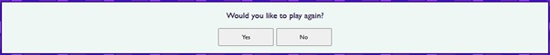
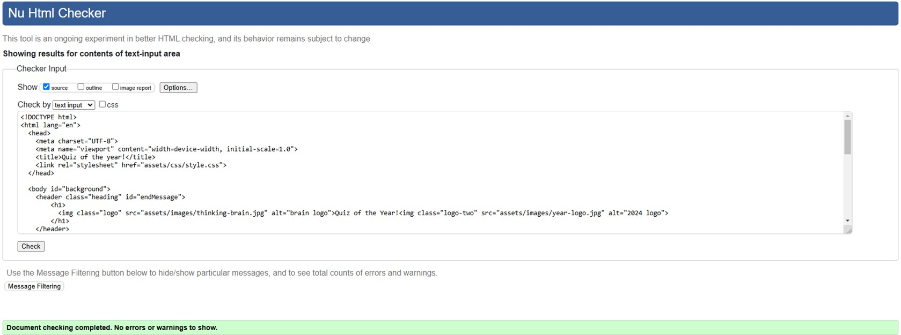
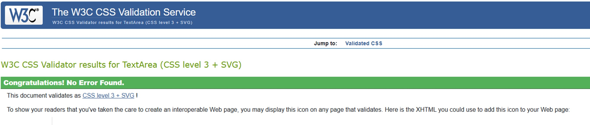
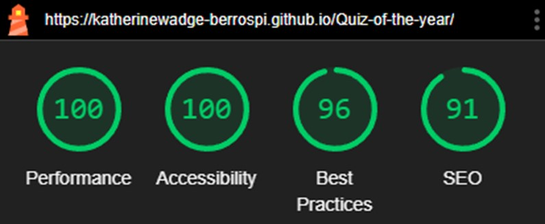
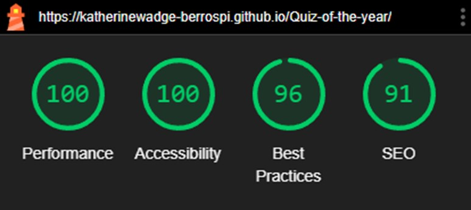

# Quiz Of The Year
A website with a fun 10 question quiz.

Project 2 for the Code Institute. Please visit the live site [here](https://katherinewadge-berrospi.github.io/Quiz-of-the-year/)

Contents:
1. [Introduction](#introduction)
2. [Features](#features)
3. [Testing](#testing)
4. [Deployment](#deployment)
5. [Future](#future)
6. [Credits](#credits) 

## Introduction

### Audience:
The Quiz Of The Year is suitable for anyone wanting to test their general knowledge of events that occurred in 2024. It raises awareness of all types of news, including sporting events, politics, and celebrity happenings.

### Client side:
This site is easy to use with clear sections, which include a header that changes once the quiz is completed, a quiz area that hosts the questions and answer buttons, a score area that tallies correct and incorrect answers, and finally a pop-up play-again question that either restarts the quiz or displays a thank-you-for-playing message.

This layout is aligned centrally and is accessible on all devices. The fun colour scheme, with background circles, is lively and engaging, complemented by a clear font in a dark purple shade to subtly match the overall design. The buttons displaying the answers are pastel-coloured for readability and change in appearance when hovered over. These changes include a red border, underlined white text, and the cursor turning into a pointer.

## Features

### Header
There are two versions of the header on the live site. The main header is displayed throughout the quiz, spanning 100% of the screen width. The font and logos decrease in size as the screen size gets smaller.

The second header is displayed once the "No" button is clicked to end the quiz. It spans 100% of the screen width, and the font decreases in size on smaller devices.

Both headers are clearly visible on all devices and complement the colour scheme. The background colour is a light purple with transparency, allowing the main backdrop circles to show through. The dark purple font ties the design together.

### Logos
The logos are related to the quiz and serve as visual anchors, flanking the main header "Quiz Of The Year!". They also both have alternative text, making it accessible to those visually impaired.

- The first logo is a vibrant cartoon image of a human head filled with abstract shapes and colours, symbolizing creativity and uniqueness.
- The second logo displays "2024" at a slant, adding a fun and dynamic element that emphasizes the quiz's focus on the year 2024.

### Quiz Area
The quiz area is light-coloured for good contrast with the dark purple font. It is outlined with a dark purple border. The font size is legible on all screen sizes, and the interactivity of the answer buttons is clearly signaled by hover effects.

### Score Area
The score area updates dynamically after each question, giving users instant feedback on their progress. The scores are bold and colour-coded for clarity: green for correct answers and red for incorrect ones.

### Play Again?
The play-again question box is hidden during the quiz and only appears at the end. It follows the same styling as other sections. Unlike the answer buttons, the "Yes" and "No" buttons are plain in colour but turn blue when hovered over.

### Footer
The footer is simple and fixed to the bottom of the screen. Its dark purple background is semi-transparent, allowing the background circles to show through. It also features a clickable link to the Sporcle website, where users can find more quizzes.

## Testing

### Validator Testing
The code in all three files (index.html, style.css, and script.js) was regularly checked for bugs before adding more features.

For example:
- Various styles were trialed, such as positioning the title in a separate top div instead of the header.
- An earlier version made the buttons grow larger on hover, which was replaced with a more subtle effect that changes the cursor, border, and font color.

On the deployed site, there are no significant bugs to fix.

<strong>HTML</strong> passed all the validator checks using W3C Markup Validator.

<strong>CSS</strong> passed all the validator checks using W3C CSS Validator.

<strong>JavaScript</strong> passed all the validator checks using JSHint on the second attempt. JSHint had recommended adding "use strict" and fixing a missing semicolon.

### Lighthouse Testing
Both desktop and mobile layouts achieved top scores across all categories in Lighthouse testing.

For Desktop:

For Mobile:

## Deployment
The site was deployed via GitHub using the 'Pages' section in the repository's 'Settings' tab, and under the 'Source' dropdown, the main branch was selected. The deployed site's URL is provided at the top of 'Pages', which was copied into the browser to double check the functionality. The site was tested on Chrome, MS Edge and Firefox, all of which displayed the content correctly.

## Future
Visual Changes:
1. Improve layout and spacing for the desktop version, especially around the quiz area and score area.
2. Explore more advanced typography for a modern look.
3. Add colour feedback for correct/incorrect answers on button clicks (e.g., green/red).
4. Enhance the finish screen with animations, GIFs, or a larger image.

Code Improvements:
1. Replace onclick attributes with modern addEventListener for cleaner, more maintainable code.
2. Merge loadQuestions and loadAnswers into a single function for efficiency.
3. Add a timer to make the quiz more challenging.
4. Introduce sound effects for correct/incorrect answers or the end screen.

## Credits

### Testing:
https://validator.w3.org/

https://jigsaw.w3.org/css-validator/

https://jshint.com/

Google Dev Tools - Lighthouse

### Tutorials and advice
https://www.w3schools.com/

https://blog.logrocket.com/advanced-effects-with-css-background-blend-modes-4b750198522a/

https://www.britannica.com/topic/2024-Year-in-Review

https://stackoverflow.com/questions/8107000/jshint-com-requires-use-strict-what-does-this-mean

https://developer.mozilla.org/en-US/docs/Web/Events

https://ui.dev/amiresponsive

https://github.com/Code-Institute-Solutions/readme-template?tab=readme-ov-file

Thank you to my Mentor Spencer Barriball for his support and guidance.