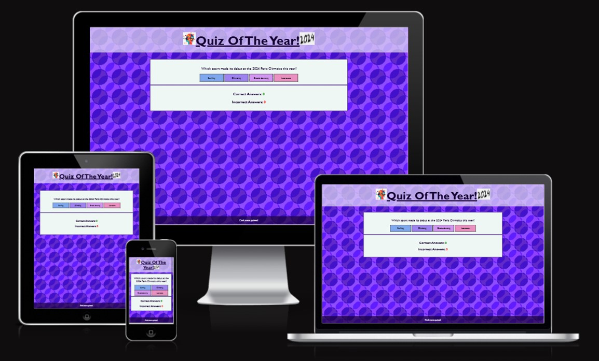
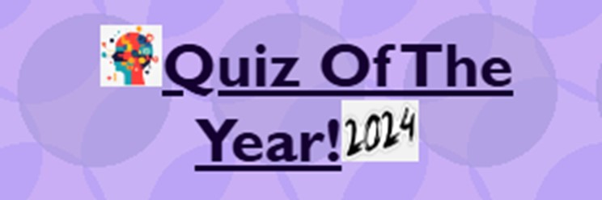
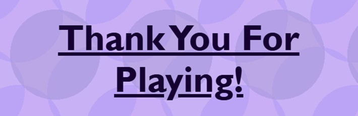

# Quiz Of The Year
A website with a fun 10 question quiz.

Project 2 for the Code Institute. Please visit the live site [here](https://katherinewadge-berrospi.github.io/Quiz-of-the-year/)

Contents:
1. [Introduction](#introduction)
2. [Features](#features)
3. [Testing](#testing)
4. [Deployment](#deployment)
5. [Future](#future)
6. [Credits](#credits) 

## Introduction

### Audience:
The Quiz Of The Year if suitable for anyone wanting to test out their general knowledge of events that occured in 2024. It raises awareness of all types of news from sporting events, politics, and celebrities.

### Client side:
This site is easy to use with clear sections which include a header that changes once the quiz if completed, the quiz area that hosts the questions and the answer buttons, a score area that tallies correct and incorrect answers, and finally a pop-up play again question to either restart quiz or displays a thank you for playing message. This layout is aligned centrally and is accessible on all devices. The fun colour scheme, with background circles, is fun and lively with a clear font that is also in the shade of dark purple to subtily compliment the overall colour scheme. The buttons that display the answers are also all coloured in pastel colours so that the text can still be easily read that changes when the mouse hovers. These changes include a red border with a white underlined text and the curser turns into a pointer.

## Features

### Header
There are two versions of the header on the live cite. The main header is displayed throughout the quiz, spanning 100% the width of the screen and the font and logos decrease in size as the device gets smaller.

The second header is displayed once the "no" button is clicked to end the quiz. It spans 100% the width of the screen and the font decreases in size as the device gets smaller.

Both headers are clearly visible on all devices and also compliment the colour scheme. The background colour is a light purple with transparancy so that the main backdrop of circles is still visible, and the dark purple font ties in with the whole page.

### Logos
The images chosen are related to the quiz and act as logos/stickers that sandwich the main header "Quiz Of The Year!". The first one is a vibrant cartoon image of a human head full of abstract shapes and different colours to show how the brain is unique. The second is an image of the year "2024" and is at a slant to make irts appearance fun and it shows that the quiz is about the year 2024 to the audience.

