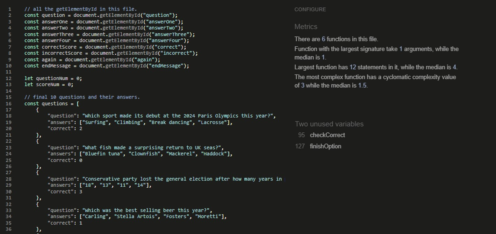

# Quiz Of The Year
A website with a fun 10 question quiz.

Project 2 for the Code Institute. Please visit the live site [here](https://katherinewadge-berrospi.github.io/Quiz-of-the-year/)

Contents:
1. [Introduction](#introduction)
2. [Features](#features)
3. [Testing](#testing)
4. [Deployment](#deployment)
5. [Future](#future)
6. [Credits](#credits) 

## Introduction

### Audience:
The Quiz Of The Year if suitable for anyone wanting to test out their general knowledge of events that occured in 2024. It raises awareness of all types of news from sporting events, politics, and celebrities.

### Client side:
This site is easy to use with clear sections which include a header that changes once the quiz if completed, the quiz area that hosts the questions and the answer buttons, a score area that tallies correct and incorrect answers, and finally a pop-up play again question to either restart quiz or displays a thank you for playing message. This layout is aligned centrally and is accessible on all devices. The fun colour scheme, with background circles, is fun and lively with a clear font that is also in the shade of dark purple to subtily compliment the overall colour scheme. The buttons that display the answers are also all coloured in pastel colours so that the text can still be easily read that changes when the mouse hovers. These changes include a red border with a white underlined text and the curser turns into a pointer.

## Features

### Header
There are two versions of the header on the live site. The main header is displayed throughout the quiz, spanning 100% the width of the screen and the font and logos decrease in size as the device gets smaller.

The second header is displayed once the "no" button is clicked to end the quiz. It spans 100% the width of the screen and the font decreases in size as the device gets smaller.

Both headers are clearly visible on all devices and also compliment the colour scheme. The background colour is a light purple with transparancy so that the main backdrop of circles is still visible, and the dark purple font ties in with the whole page.

### Logos
The images chosen are related to the quiz and act as logos/stickers that sandwich the main header "Quiz Of The Year!". The first one is a vibrant cartoon image of a human head full of abstract shapes and different colours to show how the brain is unique. The second is an image of the year "2024" and is at a slant to make irts appearance fun and it shows that the quiz is about the year 2024 to the audience.

### Quiz Area
The main quiz area is light in colour for good contrast with the dark purple font and it outlined with a dark purple border. The font size is legible on all screen sizes and it is clear that the answers below are interactive as when you hover over them, they change in appearance as does the cursor.

### Score Area
The score area is updated after each question in asnwered, showing users a glimpse as to how well they are doing then and there. The scores are all in bold for easy viewing and the correct score is green while the incorrect score is in red.

### Play Again?
The play again question box is hidden throuhgout the quiz until the end when the user has decided they don't want to play again. It follows the same styling as the other areas, however, unlike the answer buttons, the yes/no buttons are plain in colour and change to blue when hovering over them.

### Footer
The footer was kept simple, and fixed to the bottom. the background colour was a dark purple that was made transparent so that the background circles could show through the footer. There is also an active link that takes you to the Spocle website, a public site full of quizes, when you click on "find more quizes!".

## Testing

### Validator Testing
The code in all 3 files (index.html, style.css, and script.js) was constantly checked for any bugs throughout the project before adding more features. Various styles were trialled, such as having the title as a top div and not in the header, and when hovering over the answer buttons, the buttons wold increase in size which was later changed to stay consistent in size and instead changing the cursor, the border, and the font colour. There were errors in the html or css checks, but JSHint advised to use "use strict" within all the functions in JavaScript and said I had missed one semicolon.

After all the debugging, the deployed site passed all the checks using The W3C Markup Validator, W3C CSS Validator Services, and JSHint.

<strong>HTML</strong> passed all the validator checks.

<strong>CSS</strong> passed all the validator checks.

<strong>JavaScript</strong> passed all the validator checks.

### Lighthouse Testing
In both the dektop and the mobile layout, the lighthouse results were identical and both showed top scores across the board.

For Desktop:

For Mobile:

## Deployment
The site was deployed via GitHub using the 'Pages' section in the repository's 'Settings' tab, and under the 'Source' dropdown, the main branch was selected. The deployed site's URL is provided at the top of 'Pages', which was copied into the browser to double check the functionality. The site was tested on Chrome, MS Edge and Firefox, all of which displayed the content correctly.

## Future
Potential visual changes:
1. The layout and spacing could be improved on the desktop layout, although a little difficult when using a laptop to write the website.
2. Only used basic fonts, although this does mean it is more compatible on different devices.
3. When the correct/ incorrect answer is clicked it could also change colour to green/ red, respectively, as well as keeping tally at the bottom.
4. The finish screen looks a little plain, could add animation/ gifs/ large image to say thank you instead.

Potential code improvements:
1. The <onlick> is outdated and hard to maintain, use more addEventListener for cleaner code.
2. Could find a way to merge the 2 functions (loadQuations and load Answers) into 1 large function for more efficiency.
3. Could also add a timer to countdown how long users have to complete the quiz, to make things more interesting.
4. Small sound effects could also be added.

## Credits

### Testing:
https://validator.w3.org/

https://jigsaw.w3.org/css-validator/

https://jshint.com/

Google Dev Tools - Lighthouse

## Tutorials and advice
https://www.w3schools.com/

https://blog.logrocket.com/advanced-effects-with-css-background-blend-modes-4b750198522a/

https://www.britannica.com/topic/2024-Year-in-Review

https://stackoverflow.com/questions/8107000/jshint-com-requires-use-strict-what-does-this-mean

https://developer.mozilla.org/en-US/docs/Web/Events

https://ui.dev/amiresponsive?

https://github.com/Code-Institute-Solutions/readme-template?tab=readme-ov-file

Thank you to my Mentor Spencer Barriball for his support and guidance.